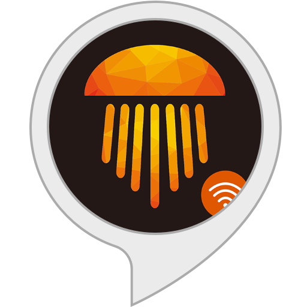

# ihomma SmartLight For Home Assistant

Personalized integration for Home Assistant to control the compatible bulbs iHomma SmartLight.
<div align="center">
  
</div>

## Description

This integration makes it possible to connect and control the bulbs compatible with the iHommaHCS application directly from Home Assistant. It supports the following features:

-ON/OFF control
-Luminosity adjustment
-Color temperature change (2700K-6500K)
-RGB colors
-predefined light effects

## Prérequis

- Home Assistant 2024.1.0 or superior
- one or more compatible bulbs iHomma
- The bulbs must be on the same network as Home Assistant

## Bulbs pairing in the WiFi network

Before you can use the bulbs with Home Assistant, you must connect them to your WiFi network. For that :

### Android
1. Download the "EspTouch" application from the Play Store 
2. Connect your smartphone to the 2.4GHz WiFi network where you want to connect your bulbs
3. Screw the bulb and put it on tension
4. Light up and turn off the bulb 3 times in a row quickly (on-off-on-off)
5. The bulb must flash quickly (or be red), indicating that it is in pairing mode
6. Open the "EspTouch" application
7. Enter the password of your WiFi network
8. Press "Confim" to launch pairing
9. The bulb will stop flashing once connected

<a href="https://play.google.com/store/apps/details?id=com.fyent.esptouch.android"></a>

### iOS
1. Download the "Espressif Esptouch" application from the App Store
2. Connect your iPhone to the 2.4GHz WiFi network where you want to connect your bulbs
3. Follow the same procedure as for Android from step 3

<a href="https://apps.apple.com/fr/app/espressif-esptouch/id1071176700"></a>

**Important notes: **
-Use only a 2.4GHz WiFi network (no 5GHz)
-The SSID and WiFi password should not contain special characters
-Keep the bulb near your router during pairing
-Once paired, note the IP address assigned to the bulb, it will be necessary for the configuration

## Configuration

Add to your `configuration.yaml`

```yaml
ihomma-sml:

light:
  - platform: ihomma-sml
    name: iHommaSML Light
    device_ip: 192.168.1.XXX